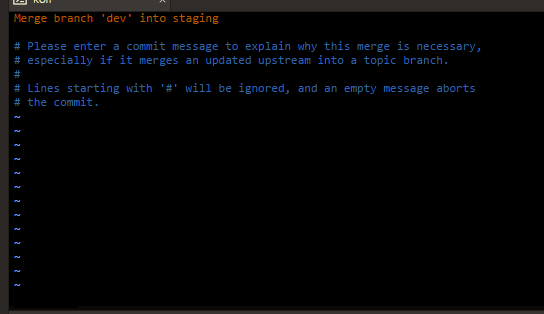

# Online collaboration using git and GitHub

[NLSEB PhD and Postdoc Day](http://nlseb.nl/nlseb2021-phd-postdoc-meeting/) workshop: online collaboration using git and GitHub

 * When: Monday April 19 2021 10.45-12.15 in Workshop session I
 * Where:  https://gather.town/i/ALM0dO9o
 * Video: your first git push [YouTube](https://youtu.be/yoDW8QCjTcY) [download (.ogv)](http://richelbilderbeek.nl/git_first_push.ogv)
 * Example for a colaborative project: [tresinformal's game](https://github.com/tresinformal/game/projects/1)


## Description

In this hands-on introductory workshop,
we will work on a (nonsense, plain-text) manuscript together as a team.
As an exemplary team member, you will create tasks,
assign yourself and show what you are working on,
using a GitHub Project Page.
Additionally, using git, we will keep a version history, that both
allows us to work independently, as well as to merge our work.

It is assumed you have a (free) GitHub account
and git (e.g. 'Git Bash' for Windows) installed.

Please send your GitHub username to richel@richelbilderbeek.nl
before April 19th 9:00.

## Schedule

When |What
-----|-------
10:45|Start
11:30|Break
11:45|Continue
12:15|End

## Coarse schedule

 * Check install git and GitHub account
 * Intro
 * Assign Issue: Clone repo
 * Your First Clone
 * Assign Issue: Your First Push
 * Your First Push
 * Your First Merge Conflict
 * Assign Issue: Work On Report
 * Work On Report
 * Assign Issue: Your First Branch
 * Your First Branch

## Detailed schedule

### Overview

At Big Table:

 * Title: Online collaboration using git and GitHub
 * Why important
 * Goal: Having worked with git and GitHub for at least 2 cycles
   * Observable: 
     * all participants assigned to an Issue and put it in the right column
     * at least 2 commits per participant

### Assign Issue: clone repo

At Big Table:

 * Demo: project page, assign Issue
 * Put people in four groups based on their name

### Your First Clone

 * Demo: get started: clone, cd and edit
   * Start of video 'your first git push' [YouTube](https://youtu.be/yoDW8QCjTcY) [download (.ogv)](http://richelbilderbeek.nl/git_first_push.ogv)
 * Make participants clone the repo and navigate into the folder
 * Close Issue

### Your First Push

 * Demo: basic workflow
   * Assign Issue
   * Basic git workflow
   * Close Issue
   * Second half of video 'your first git push' [YouTube](https://youtu.be/yoDW8QCjTcY) [download (.ogv)](http://richelbilderbeek.nl/git_first_push.ogv)
   * Weird things? Share with table. Entire table done/weird: come back
 * Make participants add, commit, push, until merge conflict

### Your First Merge Conflict

 * Demo: merge conflict: why important, how to fix it, demo
 * Make participants add, commit, push, and solve merge conflicts
 * Demo: branching

## Cheat sheet

### Your First Clone

```
git clone https://github.com/richelbilderbeek/nlseb_collaboration_20210419.git
cd nlseb_collaboration_20210419
```

### Your First Push

```
mousepad report_1.md
git add .
git commit -m "What I did"
git config --global user.name "richelbilderbeek"
git config --global user.email richel@richelbilderbeek.nl
git commit -m "What I did"
git push
```

### The vim spell

Whenever you see `vim`, do `escape`, then `:wq`, then `enter`.



### Your Second Push

```
git pull
mousepad report_1.md
git add .
git commit -m "What I did"
git push
```


### Branching

```
git checkout richel
git merge develop
```

### Misc

Show the status:

```
git status
```

Give password once per 10 hours:

```
git config --global credential.helper cache
git config --global credential.helper 'cache --timeout=36000'
```
TEST by KBr


Richel maybe was on the website again
bla bla bla


I have used Git in the wrong way for over five years - Manon
Lisa was also on the website

Merge conflict yet?
Richel maybe was on the website again
conflict solved?

bla bla
I have used Git in the wrong way for over five years - Manon
Lisa was also on the website
Solving all the conflicts :D
